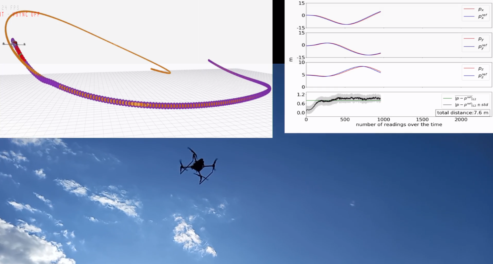

# Trajectory-Tracker 

__Authors__: Geesara Kulathunga, Hany Hamed, Dmitry Devitt, Roman Fedorenko and Alexandr Klimchik

<p align="center">
  
  
  
  
</p>

Complete videos: 
[Checking the tracking accuracy without considering obstacles](https://www.youtube.com/watch?v=pKVeGdr8crU),
Checking the behaviour in a challenging environment [test1](https://youtu.be/g6xHvkcrYcQ), [test2](https://youtu.be/Iq_arX499gA), 
Working with dynamic obstacles [test1](https://youtu.be/STLNWpAXBbg),[test2](https://youtu.be/2e4NsGbWfR8), [Testing on a simulated environment](https://youtu.be/szW8HNX8O3M),[ Estimating mean computation time or run-time](https://youtu.be/jyDe5BSigm8). 

## Table of Contents
* [Docker container](#Install-Docker-Container)
* [Prerequisites](#Prerequest)
* [Building with ROS](#2-Building-with-ROS)
* [Running the trajectory tracker](#3-Running-the-trajectory-tracker)
* [Running the trajectory tracker in a docker container](#4-Running-the-trajectory-tracker-in-a-docker-container)
* [Test dataset](#5-test-dataset)

## Install Docker Container

  Follow the instructions in `trajectory-tracker/docker_compose`

##### These instructions assume you have the necessary tools and dependencies for building the project without Docker


## 1. Prerequisites 

The project is developed and tested on Ubuntu 18.04, ROS Melodic for DJI and PX4. Following external libaries are needed before running trajectory tracker 

Installing CasADi and IPOPT 
```
  https://github.com/casadi/casadi/wiki/InstallationLinux  
```
Installing CNPY 
```
https://github.com/rogersce/cnpy
```
Installing PX4
```
https://docs.px4.io/master/en/config/firmware.html
```

## 2. Building with ROS

Once you installed all the prerequisites, clone this repository to the catkin workspace and try to build 

```
  cd ${YOUR_WORKSPACE_PATH}/src
  git clone https://github.com/GPrathap/trajectory-tracker.git
  cd ../
  catkin build
```

## 3. Running the trajectory tracker 

##### To start Gazebo with necessary components 
   ``roslaunch drone_sim sim.launch``
  
##### For arming and chaging the controlling mode 
``roslaunch state_machine take_off.launch``

##### This will launch trajectory tracker and Rviz 
``roslaunch state_machine fsm_trajectory_tracker.launch``

##### Finally, to send controlling command to quadrotor
``roslaunch state_machine px4_reg.launch``

## 4. Running the trajectory tracker in a docker container
Use `docker/install_build_run.sh` script for installing and running the docker container, 

  - Commands:
    - run  start  docker environment.
    - start  start  docker environment.
    - enter  enter  docker environment.
    - stop   stop  docker environment.

Here, all the necessary external libraries are installed or it is ready to use. The catkin workspace /root/catkin_ws/src/HagenPlanner

## 5. Test dataset 

``waypoints_all.csv`` files which located at ``hagen_planner/state_machine/data/`` consists of 100 different paths. Each of those paths is discribed by a set of waypoints, i.e., 4 to 16. Start and end waypoint are guranteen not to be within the obstacles. On the other hand, intermediate waypoints cloud be inside or partically within the obstacles. In order to generate the octomap and point cloud of a simulated world in Gazebo you may use [this script](https://github.com/GPrathap/forest_gen/blob/master/genForests_WithoutWorld.sh) in [this repo](https://github.com/GPrathap/forest_gen). Each row of ``waypoints_all.csv`` is expressed in the following format:

``path_id, world_number, waypoint_1_x, waypoint_1_y, waypoint_1_z, ..., waypoint_n_x, waypoint_n_y, waypoint_n_z``

Some of the example trajectories:

<p align="center">
  
  
  
  
</p>


Please cite at least one of our papers if you use this project in your research

- [__Optimization-Based Trajectory Tracking Approach for Multi-Rotor Aerial Vehicles in Unknown Environments__](https://arxiv.org/pdf/2202.06056.pdf), Kulathunga, Geesara, et al., IEEE Robotics and Automation Letters (**RA-L**), 2022.
- [__Trajectory tracking for quadrotors: An optimization‐based planning followed by controlling approach.__](https://www.researchsquare.com/article/rs-963714/v2), Kulathunga, Geesara, et al., Journal of Field Robotics 39.7, 2022. 


